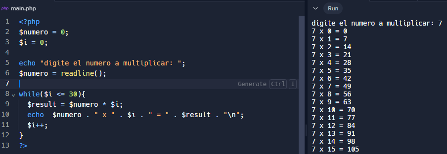
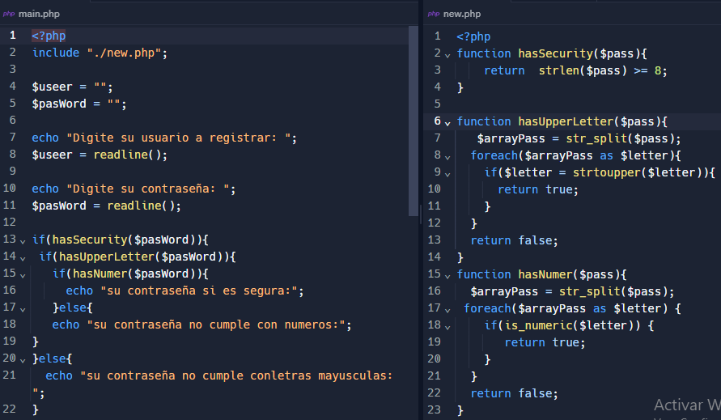

<h2>taller-10  Sebastian Poveda Araque </h2>

<h2>Informacion </h2>

<h2>Curso: Full-Stack Basico Grupo 1 </h2>

<h2>Profesor: Cristian Patiño </h2>

<h2>Punto 1: Constantes y Variables</h2>

<h2>Punto 2: suma de constantes y variables</h2>

<h2>Punto 3: suma de dos numeros indicados por usuario</h2>

<h2>Punto 4: datos del usuario en console</h2>

<h2>Punto 5: entrada de bolera usando if / else</h2>

<h2>Punto 6: deteccion de mayoria de edad</h2>

<h2>Punto 7: seleccion de operacion aridmetica</h2>

<h2>Punto 8: entrada a la bolera con switch</h2>

<h2>Punto 9: tabla de multiplicar usando while</h2>

<h2>Punto 10: numeros pares usando while</h2>

<h2>Punto 11: numeros impares usando for</h2>

<h2>Punto 12: tabla de miltiplicar usando for</h2>

<h2>Punto 13: suma de valores de un arreglo  usando foreach</h2>

<h2>Punto 14: revicion de contraseña</h2>

<h2>Punto 15: seleccion de operacion aritmetica usando funciones</h2>

